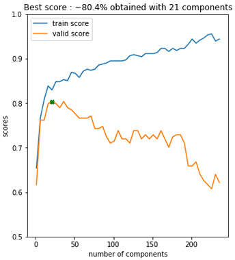

# BzzML

"Introduction to machine learning" project - Polytech ET4 IT - Noted for S8 (2020-2021)

## Asked work

- [Working guide for the project](./doc/guide-projet.pdf) :fr:

The subject has been chosen by the students. The unsupervised learning model too..

All remaining bugs are listed [here](https://github.com/adepreis/BzzML/issues).

## Getting Started

These instructions will get you a copy of the project up and running on your local machine for development purpose.

### Prerequisites

Things you need to install the project :

- [Jupyter](https://jupyter.org)
- [Python 3](https://www.python.org/downloads)
	- [Scikit-Learn](http://scikit-learn.org) library
	- [Scikit-Image](https://scikit-image.org) library
	- [NumPy](http://numpy.org) library
	- [Matplotlib](http://matplotlib.org) library
	<!--
	- [PIL](https://pypi.org/project/Pillow) library 
	??? -->

### Running

Here are some instructions on how to get the development env running.

First, clone this repository with the following command :

	$ git clone https://github.com/adepreis/BzzML

Then, after moving into the `/BzzML` folder just created, start Jupyter using :

	$ jupyter notebook

or 

	> jupyter-notebook.exe

if you are a Windows user.

This should open up your browser (if it doesn't, visit [127.0.0.1:8888](http://127.0.0.1:8888/tree)), and you should see Jupyter's tree view, with the contents of the current directory.

**If you are not familiar with Jupyter Notebooks**, the most recent [release](https://github.com/adepreis/BzzML/releases) includes the corresponding `.py` files.

---

### How it works

After being pre-proceeded (reduced 15 times and "sobel-filtered"), the dataset is divided in training and validation sets before being passed to a PCA (Principal Component Analysis) and then to a Gaussian Naive Bayesian model.

|   Gaussian Naive Bayesian	  	| SVC (Support Vector Classifier) |
|:-------------------------------------:|:-------------------------------:|
|  |  |

As you can see, we obtained even better results with a Support Vector Classifier. Some work has also been done on the SVC parameters :

---

### Authors

* **Lucas B.** - @0xWryth
* **Antonin D.** - @adepreis

---

## Dataset

In the `/data` folder, you can find the `/image` folder where you should place the dataset images. <!-- I guess we are not allowed to share the dataset (requires a Kaggle account to be downloaded) and should ask the user to download it by itself. -->

The used image dataset has been shared by [Ivan Felipe Rodriguez](kaggle.com/ivanfel) under _Honey Bee pollen_ [kaggle repository](https://www.kaggle.com/ivanfel/honey-bee-pollen) in the framework of the following publication :

<!-- If you publish work based on this dataset, please cite the following publication: -->

> Ivan Rodriguez, Rémi Mégret, Edgar Acuña, José Agosto, Tugrul Giray. Recognition of pollen-bearing bees from Video using Convolutional Neural Network, IEEE Winter Conf. on Applications of Computer Vision, 2018, Lake Tahoe, NV. https://doi.org/10.1109/WACV.2018.00041

---

## Documentation

In the `/doc` folder, you can find ... <!-- a brief [report](./doc/report.pdf) that explains the design choices and contains screenshots... --> ?